# WindowTabs

**Language:** [Japanese/日本語](README_Japanese.md)

WindowTabs is a utility that enables tabbed UI for Windows applications that don't have a tab interface, as well as between different executables. You can manage Chrome and Edge with tabs, or manage multiple Excel windows or Excel and Word with tabs.

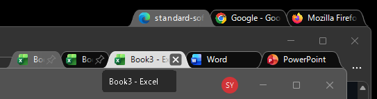

It was originally developed by Maurice Flanagan in 2009 and was provided back then as both free and paid versions.
The author has now open-sourced the utility.

- https://github.com/mauricef/WindowTabs (404 Not Found)

Mr./Ms. redgis forked it and migrated to VS2017 / .NET 4.0.

- https://github.com/redgis/WindowTabs (404 Not Found)

Mr./Ms. payaneco forked the source code.
- https://github.com/payaneco/WindowTabs
- https://github.com/payaneco/WindowTabs/network/members
- https://ja.stackoverflow.com/a/53822

Mr./Ms. leafOfTree also created a fork with various improvements:
- https://github.com/leafOfTree/WindowTabs
- https://github.com/leafOfTree/WindowTabs/network/members

This version (ss_jp_yyyy.mm.dd) is forked from payaneco's repository and incorporates some code implementations from leafOfTree's version. Maintained by [Satoshi Yamamoto (@standard-software)](https://github.com/standard-software).

Can be compiled with Visual Studio 2026 Community Edition.
- https://github.com/standard-software/WindowTabs

## Index
- [Version](#Version)
- [Download](#Download)
- [Installation](#Installation)
- [Usage](#Usage)
- [Features](#Features)
- [Settings](#Settings)
- [Links](#Links)
- [License](#License)
- [Comments](#Comments)

## Version

Latest version: **ss_jp_2026.03.22_next1**

For detailed version history and changelog, see [version.md](version.md).

## Download

**Supported OS:** Windows 10, Windows 11

You can download prebuilt files from the [releases](https://github.com/standard-software/WindowTabs/releases) page.

Two download options are available:

- **WtSetup.msi** - Windows Installer package with automatic installation and uninstallation support
- **WindowTabs.zip** - Portable version that can be extracted and run from any location

You can also build the installer and portable version yourself using the provided build scripts.

## Installation

### Using the MSI Installer (WtSetup.msi)

1. Download `WtSetup.msi` from the [Releases](https://github.com/standard-software/WindowTabs/releases) page
2. Run the installer and follow the installation wizard
3. Choose the installation directory (default: Program Files\WindowTabs)
4. Desktop shortcut and Start Menu shortcut will be created automatically
5. Optionally launch WindowTabs at the end of installation

### Using the Portable Version (WindowTabs.zip)

1. Download `WindowTabs.zip` from the [Releases](https://github.com/standard-software/WindowTabs/releases) page
2. Extract the archive to your preferred location
3. Run `WindowTabs.exe`
4. WindowTabs will run in the background and add a tray icon

To run WindowTabs at startup:
- Enable "Run at startup" option in the Settings > Behavior tab

## Usage

1. Run `WindowTabs.exe`
2. Windows will automatically get tabs when grouped together
3. Right-click the tray icon to access settings
4. Right-click on tabs to access tab-specific options
5. Drag and drop tabs to organize your windows

## Features

### Tab Drag and Drop

This feature remains unchanged from the original WindowTabs functionality.

- Drag tabs to reorder within the same group
- Drag tabs to separate into new windows with preview
- Drop windows to create new tab groups

### Tab Management

- **Tab Context Menu**: Right-click on tabs to access various options
  - New tab
  ---
  - Move Left / Move Right (with Snap)
  - Move Other
  ---
  - Display Left / Display Main / Display Right
  ---
  - Link to another group
  ---
  - Tab Detach and Split (submenu)
  ---
  - Close Tab (submenu: this tab, tabs to the left/right, other tabs, all tabs)
  ---
  - Tab Pin (submenu: Pin/Unpin this tab, Pin all, Unpin all, Pin/Unpin left/right tabs in alignment group)
  - Tab Color Change (submenu: fill / underline / border color options, reset)
  ---
  - Tab Margin When Snapping (per-tab-group toggle)
  - Tab Position (Align Left / Align Right per-tab, Align all tabs, Align left/right tabs in group)
  - Tab Name (rename / reset)
  ---
  - Settings

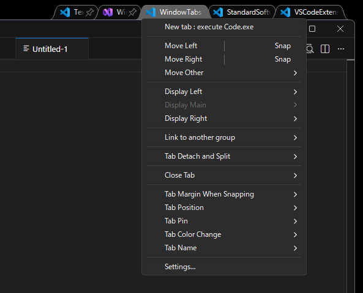

#### Reposition

Top level menu options:
- Move Left / Move Right - Move to the left or right edge of the current display
- Snap Left / Snap Right - Snap to the left or right side of the screen (full height)

"Move Other" submenu:
- Move Top / Move Bottom
- Snap Top / Snap Bottom
- "Corner" submenu: Top-Left, Top-Right, Bottom-Left, Bottom-Right

"Snap x%" submenu:
- Left / Right / Top / Bottom
- Top-Left, Top-Right, Bottom-Left, Bottom-Right - Corner snap with percentage options
- Center, Center Horizontally, Center Vertically
- Snap Display / Snap Desktop - Resize to fill current display or entire desktop (without using Windows maximize)
- DPI-aware percentage-based positioning for correct placement across different DPI displays

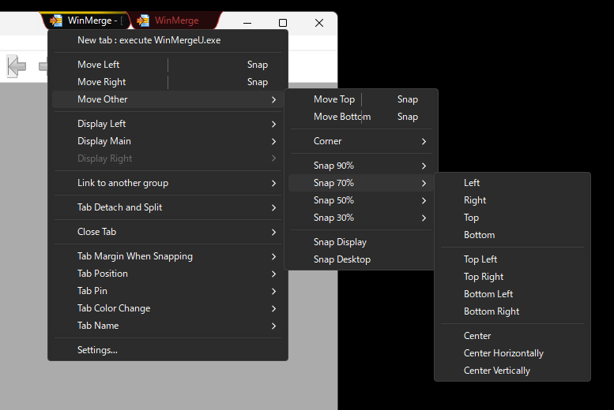

#### Link to another group

Link a tab or tabs to another existing group:
- Shows other groups with tab names and counts
- Displays the application icon of the first tab in each group

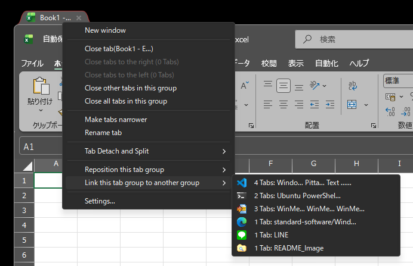

#### Detach this tab / Split right/left side

Detach a single tab from a tab group,
or split tabs to the right or left from the selected tab,
and reposition or link to another group.

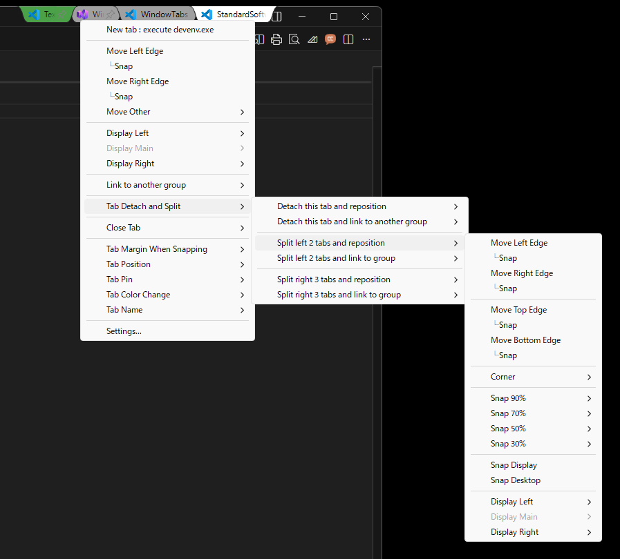

#### Close Tab

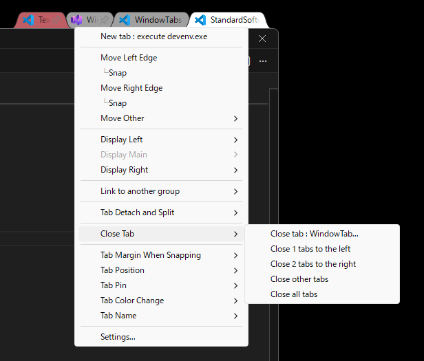

### Pinned Tabs

Pin tabs to keep them in a fixed position on the left side of the tab strip, similar to browser pinned tabs.

- Pin or unpin individual tabs, or pin/unpin all tabs in a group at once
- Pin/unpin left or right tabs within the same alignment group
- Pinned tab width can be set to icon-only size or a specified fixed width
- When using specified width, a pushpin icon allows unpinning
- Dragging a tab into the pinned zone automatically pins it

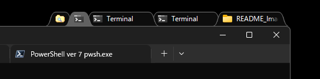  
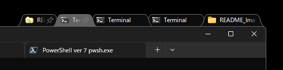
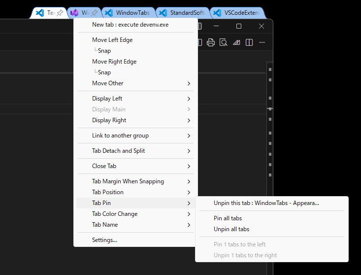

### Tab Color

Set a color on individual tabs for visual identification. Three color types are available:

- **Fill**: Semi-transparent color overlay on the tab background
- **Underline**: Colored line at the bottom of the tab with a left-to-right gradient
- **Border**: Colored outline around the tab (1px curves + gradient bottom edge)

**7 colors**: Red, Blue, Green, Yellow, Purple, Orange, Pink

- Right-click a tab and use the "Tab Color Change" submenu
- Fill, underline, and border are mutually exclusive (setting one clears the others)
- Checkmark overlay on the color icon when the tab's current color matches
- Reset per-tab or all tabs at once
- Colors are persisted across restarts

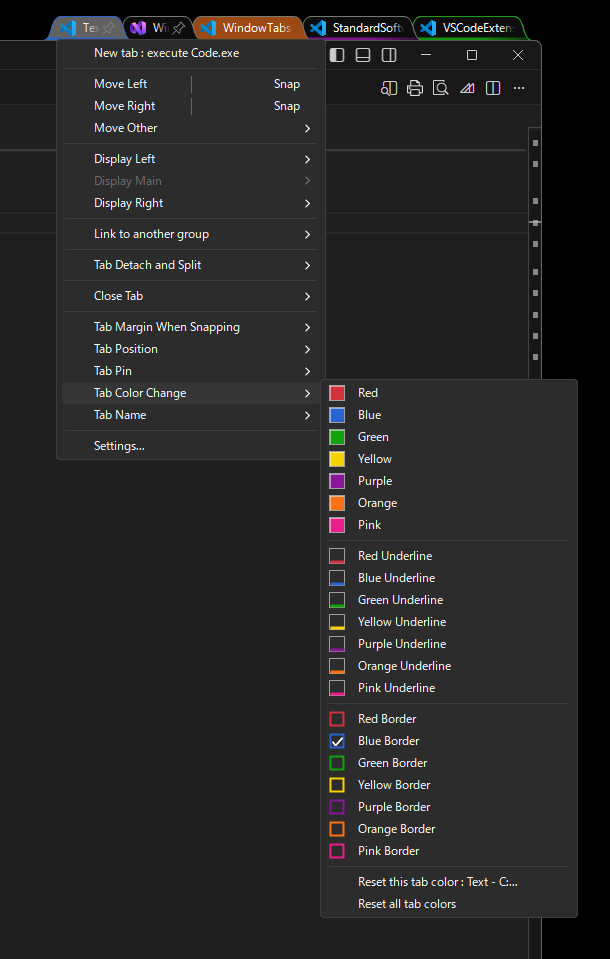

### Per-Tab Alignment

Each tab can be individually set to left or right alignment within a tab group:

- **Align Left**: Tab is positioned from the left edge of the tab strip
- **Align Right**: Tab is positioned from the right edge of the tab strip
- Drag & drop alignment detection: dragging past the center of the empty space changes tab alignment
- "Align all tabs to Left/Right" to change all tabs at once
- "Align X left/right tab(s) in [group] to [target]" to change multiple tabs within the same alignment group
- Per-tab alignment is persisted across group transfers and application restarts
- Close, color, and split operations use visual order; pin and align operations work within the same alignment group

### Menu Dark Mode / Light Mode

While light mode is the default, dark mode is also supported for context menus (popup menus) as shown in the screenshots.

- Toggle via "Menu Dark Mode" checkbox in Appearance settings
- Applies to tab context menu and drag-and-drop menus

### Multi-Display and DPI Support

- Multi-display support with proper window positioning
- DPI-aware window placement
- Automatic window resizing when dropped to prevent exceeding monitor dimensions
- Fixed tab rename floating textbox positioning on high-DPI displays

### Virtual Desktop Support

WindowTabs fully supports Windows virtual desktops (Win+Tab):

- Tab groups are preserved when switching between virtual desktops
- UWP apps (Settings, Calculator, etc.) are properly hidden when on other virtual desktops
- Tab group state is preserved across all virtual desktops during WindowTabs restart

### UWP Application Support

- Supports UWP (Universal Windows Platform) applications
- Automatically handles UWP window Z-order for proper tab visibility
- Maintains tab visibility when working with UWP apps
- Properly detects cloaked state when apps are on other virtual desktops

### Multi-Language Support

- English, Japanese, Chinese Simplified, and Chinese Traditional language support
- Japanese Kansai and Tohoku dialect files included
- Language files can be customized to support any language **(WtProgram/Language)**
- Runtime language switching without restart
- Switch languages via tray menu

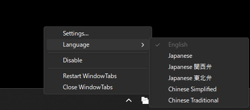

### Disable Feature

Temporarily disable WindowTabs functionality via tray menu:
- **Disable** checkbox in tray icon context menu
- When enabled:
  - Immediately hides all existing tab groups
  - Stops automatic tab grouping for new windows
  - Disables Settings menu to prevent configuration changes
- When re-enabled:
  - Restores your previous tab group configuration

### Tab Group Persistence

WindowTabs preserves your tab group configuration across restarts and disabling:

- **Restart Persistence**: Tab groups are automatically saved when WindowTabs exits and restored on next startup
  - Tab order, grouping, and renamed tab names are preserved
  - Windows are matched by window handle for reliable restoration
  - **All virtual desktops** are restored, not just the current one
- **Disable/Enable Persistence**: Tab groups are preserved when temporarily disabling WindowTabs
  - Re-enabling restores your previous tab configuration

### Watchdog Auto-Restart

- WindowTabs may occasionally freeze in certain situations:
  - Switching monitors
  - Waking from sleep or hibernate
  - Changing Windows display settings
- A watchdog mechanism automatically detects unresponsive states and restarts the application
- Tab group configuration is preserved and restored after restart

## Settings

Access settings by right-clicking the tray icon and selecting "Settings" or by right-clicking on a tab and selecting "Settings...".

### Programs Tab

Configure which programs should use tabs and auto-grouping behavior.

- **Tabs**: Enable/disable tabbing for each program
- **Auto Grouping**: When enabled, windows of the same program are automatically grouped into the same tab group
- **Category 1-10**: Assign programs to a category for cross-application auto-grouping
  - Programs in the same category are automatically grouped together regardless of the executable
  - For example, assign Word, Excel, PowerPoint, etc. to the same category to auto-group Office apps together
  - For example, assign Chrome, Edge, Firefox, etc. to the same category to auto-group browsers together
  - Category columns are only visible when Auto Grouping is enabled for a program
  - Programs are sorted by category number for better visibility
- **Show all settings**: Checkbox to display settings for programs not currently running
- **Delete button [x]**: Remove settings for non-running processes

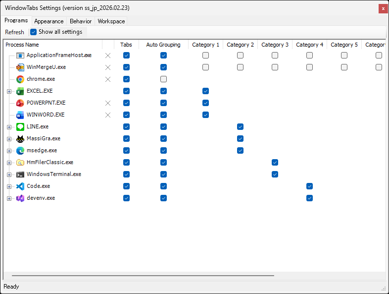

### Appearance Tab

Customize the visual appearance of tabs:
- Tab height, tab width (max), pinned tab width, and tab overlap settings (with separate reset buttons per control)
- Pinned tab width: "Icon Only" or specify a custom width
- Distance from edge settings
- Menu Dark Mode toggle
- Combined Move and Snap Menu: displays Move and Snap as a single combined line in the context menu
- Color settings for each tab state (Inactive, Mouse Over, Active, Flash)
  - Tab color, text color, and border color
- Color theme with preset themes (Light, Light Mono, Dark, Dark Blue, Dark Mono, Dark Red Frame)
- Custom color theme features
  - Save/edit/delete custom themes
  - Import/export themes via clipboard
  - If you create a nice color theme, please share it at [GitHub Issues](https://github.com/standard-software/WindowTabs/issues). Your theme may be included as a preset theme. We'd love for others to enjoy your cool color themes!

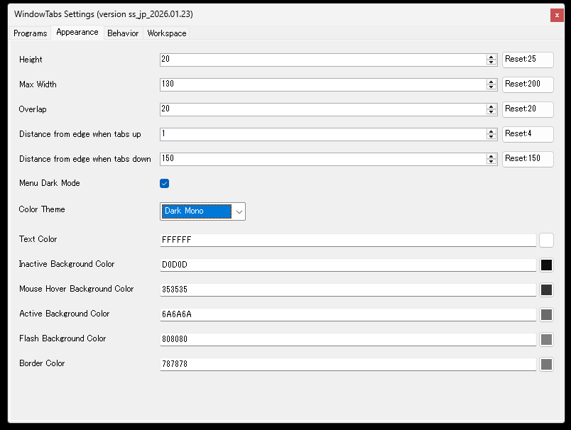  
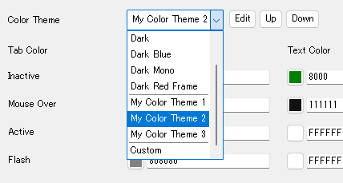  
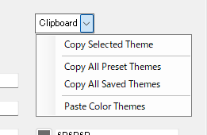  

### Behavior Tab

Configure tab behavior:

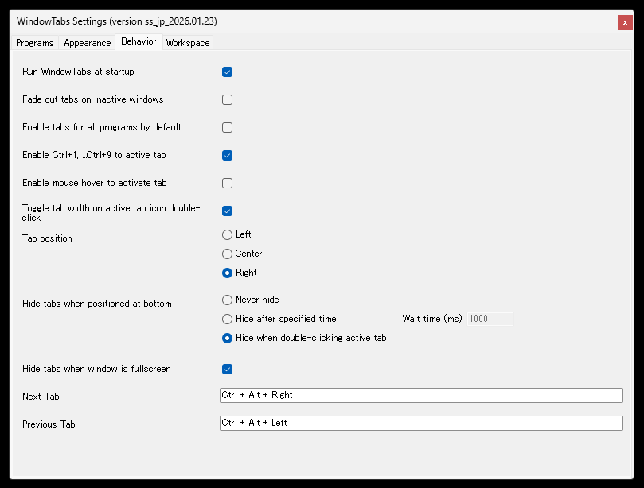

### Workspace Tab

This feature remains unchanged from the original WindowTabs functionality.

## Building from Source

### Prerequisites

- Visual Studio 2026 Community Edition
- WiX Toolset v3.11 or newer (for building the MSI installer)

### Build Scripts

A build script is provided in the project root:

- **build_release.bat** - Builds both the MSI installer and the portable ZIP distribution
  - Output: `exe\installer\WtSetup.msi`
  - Output: `exe\zip\WindowTabs.zip`

Simply run the batch file to create the distribution packages.

## Links

### Japanese Resources

- WindowTabs のダウンロード・使い方 - フリーソフト100  
  https://freesoft-100.com/review/windowtabs.html

- どんなウィンドウもタブにまとめられる「WindowTabs」に日本語派生プロジェクトが誕生（窓の杜） - Yahoo!ニュース  
  https://news.yahoo.co.jp/articles/523e4c5b9db424bb1edfc582d647c1624a9b7502 (404 Not Found)

- どんなウィンドウもタブにまとめられる「WindowTabs」に日本語派生プロジェクトが誕生 - 窓の杜  
  https://forest.watch.impress.co.jp/docs/news/2067165.html

- WindowTabs のダウンロードと使い方 - ｋ本的に無料ソフト・フリーソフト  
  https://www.gigafree.net/utility/window/WindowTabs.html

- C# - WindowTabs というオープンソースを改良してみたいのですがビルドができません。何か必要なものがありますか？ - スタック・オーバーフロー  
  https://ja.stackoverflow.com/questions/53770/windowtabs-というオープンソースを改良してみたいのですがビルドができません-何か必要なものがありますか

- 全Windowタブ化。Setsで頓挫した夢の操作性をオープンソースのWindowTabsで再現する。 #Windows - Qiita  
  https://qiita.com/standard-software/items/dd25270fa3895365fced

## License

This project is open source and licensed under the MIT License.

## Credits

- Original author: Maurice Flanagan
- Fork contributors: redgis, payaneco, leafOfTree
- Current maintainer: Satoshi Yamamoto (standard-software)

## Comments

If you have any issues, please contact us via GitHub Issues or email: `standard.software.net@gmail.com`

