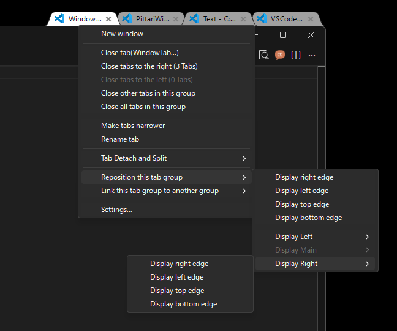

# WindowTabs

**Language:** [English](README.md)

WindowTabs はインターフェースを持たない Windows アプリケーションや、異なる実行ファイル間でタブ UI を有効にするユーティリティです。Chrome と Edge をタブで管理、複数の Excel や Word のウィンドウをタブで管理が可能になります。

元々は Maurice Flanagan 氏によって2009年に開発され、当時は無料版と有料版が提供されていました。
開発者は現在、このユーティリティをオープンソース化しています。

- https://github.com/mauricef/WindowTabs (404 Not Found)

redgis 氏がフォークし、VS2017 / .NET 4.0 に移行しました。

- https://github.com/redgis/WindowTabs (404 Not Found)

payaneco 氏がソースコードをフォークしました。
- https://github.com/payaneco/WindowTabs
- https://github.com/payaneco/WindowTabs/network/members
- https://ja.stackoverflow.com/a/53822

leafOfTree 氏も様々な改良を加えたフォークを作成しています:
- https://github.com/leafOfTree/WindowTabs
- https://github.com/leafOfTree/WindowTabs/network/members

このバージョン (ss_jp_yyyy.mm.dd) は payaneco 氏のリポジトリからフォーク、leafOfTree 氏が行ったコード実装の一部が組み込まれています。メンテナンスは、[Satoshi Yamamoto (@standard-software)](https://github.com/standard-software) が行っています。

Visual Studio 2022 または 2026 Community Edition でコンパイルできます。
- https://github.com/standard-software/WindowTabs

## 目次
- [バージョン](#バージョン)
- [ダウンロード](#ダウンロード)
- [インストール](#インストール)
- [使用方法](#使用方法)
- [機能](#機能)
- [設定](#設定)
- [リンク](#リンク)
- [ライセンス](#ライセンス)
- [コメント](#コメント)

## バージョン

最新のバージョン: **ss_jp_2026.01.24**

詳細な更新履歴と変更ログについては、[version.md](version.md) を参照してください。

## ダウンロード

**対応している OS:** Windows 10、 Windows 11

[releases](https://github.com/standard-software/WindowTabs/releases) ページからビルド済みのファイルをダウンロードできます。

2 つのダウンロードオプションがあります:

- **WtSetup.msi** - 自動インストールとアンインストールをサポートしている Windows インストーラーパッケージ版
- **WindowTabs.zip** - 任意の場所で展開して実行可能なポータブル版

提供しているビルドスクリプトを使用して、インストーラー版とポータブル版を自分でビルドすることもできます。

## インストール

### MSI インストーラー版の使用方法 (WtSetup.msi)

1. [Releases](https://github.com/standard-software/WindowTabs/releases) ページから `WtSetup.msi` をダウンロード
2. インストーラーを実行してインストールウィザードに従って操作します
3. インストール先のディレクトリを選択 (既定: Program Files\WindowTabs)
4. デスクトップとスタートメニューにショートカットが自動で作成されます
5. オプションでインストール後に WindowTabs を起動

### ポータブル版の使用方法 (WindowTabs.zip)

1. [Releases](https://github.com/standard-software/WindowTabs/releases) ページから `WindowTabs.zip` をダウンロード
2. アーカイブを任意の場所に展開します
3. `WindowTabs.exe` を実行
4. WindowTabs がバックグラウンドで実行され、トレイアイコンが表示されます

WindowTabs をスタートアップ時に起動:
- オプションから`スタートアップ時に起動`を有効 > タブの動作

## 使用方法

1. `WindowTabs.exe` を実行
2. Window をグループ化すると自動でタブが表示されます
3. トレイアイコンを右クリックで設定にアクセスできます
4. タブを右クリックでタブ固有のオプションにアクセスできます
5. タブをドラッグ&ドロップでウィンドウを整理できます

## 機能

### タブのドラッグ&ドロップ

これは元の WindowTabs の機能から変更されていません。

- タブをドラッグして同じグループ内で順番を変更
- タブをドラッグしてプレビュー付きの新規ウィンドウに分割
- ウィンドウをドロップで新規タブグループを作成
- タブの配置設定を尊重 (左/中央/右)

### タブの管理

- **タブのコンテキストメニュー**: 右クリックでタブの様々な機能にアクセスできます
  - 新規ウィンドウ
  - タブを閉じる (このタブ、右側のタブ、左側のタブ、その他タブ、すべてのタブ)
  - タブの幅を拡張 / 縮小
  - タブの名前を変更
  - ---
  - タブを切り離して位置を変更
  - タブを切り離して別のグループにリンク
  - タブグループの位置を変更
  - タブグループを別グループにリンク
  - 設定

### タブを切り離して位置を変更

タブをグループから切り離しとマルチディスプレイのサポートで再配置できます:
- 同じ位置での切り離し
- 画面の端に移動 (右/左/上/下)
- 異なる DPI ディスプレイでも正確に配置するための、DPI を考慮したパーセンテージベースの位置指定

### タブグループの位置を変更

タブグループ全体を別の表示位置に移動できます:
- 現在の画面の端に移動 (右/左/上/下)
- 画面端に配置のオプションを使用して他のディスプレイに移動
- 異なる DPI ディスプレイ間での正確な配置を実現するための DPI 対応
- 再配置時にタブグループの整合性を維持

### タブを切り離して別のグループにリンク

現在のグループから 1 つのタブを切り離して既存のグループにリンクできます:
- タブの名前とタブの数とともに他のグループを表示
- タブの名前を自動で切り捨てで認識しやすくする
- グループを識別しやすくするためにアプリケーションアイコンを表示
- タブグループにタブが 1 つしかない場合に無効

### タブグループを別のグループにリンク

現在のグループから別の既存のグループにすべてのタブを転送できます:
- タブの名前とタブの数とともに別のグループを表示
- 現在のグループから対象のグループにすべてのタブを一括で転送
- タブの名前を自動で切り捨てで認識しやすくする
- グループを識別しやすいようにアプリケーションアイコンを表示

### ダークモード / ライトモードのメニュー

ライトモードが既定ですが、スクリーンショットのようにコンテキストメニュー (ポップアップメニュー) でのダークモードをサポートしています。

- 外観設定の「ダークモードメニュー」のチェックボックスで切り替え
- タブのコンテキストメニューとドラッグ&ドロップメニューに適用されます

### マルチディスプレイと高 DPI をサポート

- 適切なウィンドウの配置によるマルチディスプレイのサポート
- DPI を考慮したウィンドウの配置
- ドロップ時にウィンドウサイズを自動で変更してディスプレイのサイズが超えてしまう問題を防止
- 高 DPI ディスプレイにおけるタブの名前変更時のフローティングテキストボックスの位置を修正

### UWP アプリをサポート

- UWP (Universal Windows Platform) をサポート
- UWP ウィンドウの Z オーダーを自動で処理し、タブの表示を適切に維持
- UWP アプリで作業する際もタブの表示を維持

### 多言語をサポート

- 英語と日本語、簡体と繁体の中国語をサポート
- 日本語の関西弁、東北弁版を同梱
- 言語ファイルでのあらゆる言語をサポート **(WtProgram/Language)**
- 再起動なしで言語を変更可能
- トレイメニューから言語を変更可能

### 無効にする機能

トレイメニューから WindowTabs の起動を一時的に無効にできます:
- トレイアイコンのコンテキストメニューのチェックボックスで**無効**に設定可能
- 無効に変更した場合:
  - 既存のタブグループを即座に非表示
  - 新規ウィンドウのタブの自動グループ化を停止
  - 設定メニューを無効にして、設定の変更を防止

## 設定

トレイアイコンを右クリックで「設定」を選択するか、タブを右クリックで「設定...」を選択して設定にアクセスします。

### プログラムタブ

これは元の WindowTabs の機能から変更されていません。

タブと自動グループ化の動作を使用するプログラムを構成できます。

### タブの外観

タブの視覚的な外観をカスタマイズできます:
- 高さ、幅、重なりの設定 (項目ごとにリセットボタンあり)
- 枠線と文字の色
- 背景の色 (アクティブ、非アクティブ、マウスオーバー、点滅)
- カラーテーマのドロップダウン (プリセットとカスタムテーマ)
- 端からの距離設定

### タブの動作

タブの動作を構成することができます:
- タブの位置 (左/中央/右)
- タブの幅 (縮小/拡張)
- アクティブなタブアイコンをダブルクリックでタブの幅を変更
- 下部に配置されたタブの非表示 (無効/常にする/ダブルクリック)
- タブを非表示にするまでの遅延設定
- 全画面ウィンドウの場合はタブを非表示
- 自動グループ設定
- ホットキー設定 (Ctrl+1...+9 でタブをアクティブ)
- マウスホバーでアクティブ

### ワークスペースタブ

これは元の WindowTabs の機能から変更されていません。

### タブの診断

これは元の WindowTabs の機能から変更されていません。

## ソースからビルド

### 前提条件

- Visual Studio 2022 Community Edition (またはそれ以降)
- WiX Toolset v3.11 またはそれ以降 (MSI インストーラー版のビルド)

### ビルドスクリプト

プロジェクトのルートに 2 種類のビルドスクリプトが用意されています:

- **build_installer.bat** - MSI インストーラー版をビルド (WtSetup.msi)
  - 出力: `exe\installer\WtSetup.msi`

- **build_release_zip.bat** - ポータブル ZIP 版の配布パッケージをビルド
  - 出力: `exe\zip\WindowTabs.zip`

必要なバッチファイルを実行で配布パッケージを作成することができます。

## リンク

### 日本語のリソース

- WindowTabs のダウンロード・使い方 - フリーソフト100
  https://freesoft-100.com/review/windowtabs.html

- どんなウィンドウもタブにまとめられる「WindowTabs」に日本語派生プロジェクトが誕生（窓の杜） - Yahoo!ニュース
  https://news.yahoo.co.jp/articles/523e4c5b9db424bb1edfc582d647c1624a9b7502 (404 Not Found)

- どんなウィンドウもタブにまとめられる「WindowTabs」に日本語派生プロジェクトが誕生 - 窓の杜
  https://forest.watch.impress.co.jp/docs/news/2067165.html

- WindowTabs のダウンロードと使い方 - ｋ本的に無料ソフト・フリーソフト
  https://www.gigafree.net/utility/window/WindowTabs.html

- C# - WindowTabs というオープンソースを改良してみたいのですがビルドができません。何か必要なものがありますか？ - スタック・オーバーフロー
  https://ja.stackoverflow.com/questions/53770/windowtabs-というオープンソースを改良してみたいのですがビルドができません-何か必要なものがありますか

- 全Windowタブ化。Setsで頓挫した夢の操作性をオープンソースのWindowTabsで再現する。 #Windows - Qiita
  https://qiita.com/standard-software/items/dd25270fa3895365fced

## ライセンス

このプロジェクトはオープンソースであり、MIT ライセンスに基づいています。

## クレジット

- オリジナルの開発者: Maurice Flanagan
- フォークの貢献者: redgis、payaneco、leafOfTree
- 現在のメンテナー: Satoshi Yamamoto (standard-software)

## コメント

何か問題がありましたら、GitHub Issues またはメールでお問い合わせください: `standard.software.net@gmail.com`

Claude Code 氏の尽力により、開発は大きく進展しました。 
しかし、設定ダイアログのダークモード対応は見た目が上手くいかなかったため、断念しました。 
誰かがこのプロジェクトをフォークして改善してくれることを願っています。
